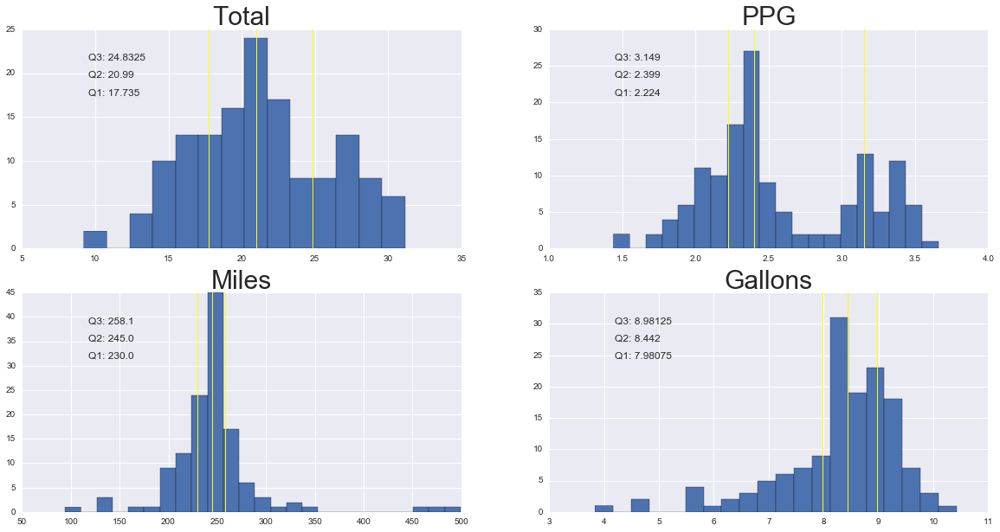
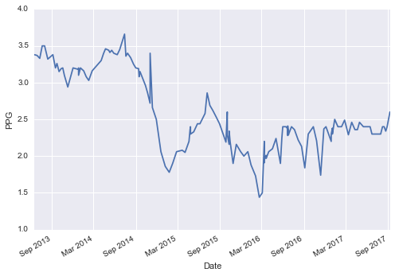
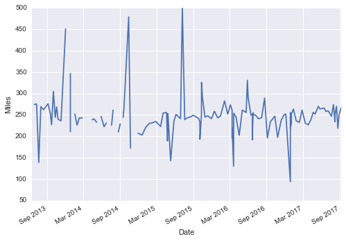
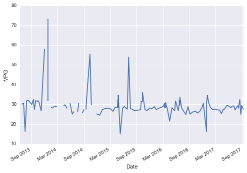

# Gas consumption of my car

This is my repository to keep track of my car's gas mileage.
I keep records of my gas consumption on a [MongoDB](https://www.mongodb.com/) database.
I have saved records from my gas receipts since August 2013:

The database located at *~/db/gas_repeipts.json* is called **'corolla_2010'** and it
contains a collection called **'gas_receipts'**.

* date
* ppg (Price per gallon)
* total money spent (I fill the gallon at 1/4 empty)
* miles traveled (I get this from my odometer)

I use [pymongo](https://api.mongodb.com/python/current/) to connect to my database
and [pandas](https://pandas.pydata.org/) + [matplotlib](https://matplotlib.org/) to explore the data.
The *gas_consumption.ipynb* notebook contains the exploration


# Analysis - Corolla 2010 (MPG)

(Disclamer: This is not a comprehensive study of corolla's efficiency. It is just an analysis of my personal vehicle )

```python
import pandas as pd
import pymongo
import matplotlib.pyplot as plt
%matplotlib inline
import seaborn
```

The database located at *~/db/gas_repeipts.json* is called **'corolla_2010'** and it contains a collection called **'gas_receipts'**.


```python
connection = pymongo.Connection()
db = connection.corolla_2010
gas_data = db.gas_receipts
```


```python
data = pd.DataFrame(list(gas_data.find()))
```

Each record in **gas_receipts** has this information:

* date
* **miles** traveled
* ppg (price per gallon)
* **total** money spent filling the tank

Note: I fill up the tank at ~1/4


```python
data[0:3]
```


<div>
<table border="1" class="dataframe">
  <thead>
    <tr style="text-align: right;">
      <th></th>
      <th>_id</th>
      <th>date</th>
      <th>galons</th>
      <th>miles</th>
      <th>ppg</th>
      <th>total</th>
    </tr>
  </thead>
  <tbody>
    <tr>
      <th>0</th>
      <td>5879ab7cd930220865146181</td>
      <td>2017-01-12 23:15:04</td>
      <td>8.605</td>
      <td>263.5</td>
      <td>2.499</td>
      <td>21.50</td>
    </tr>
    <tr>
      <th>1</th>
      <td>5879aed6d930220865146183</td>
      <td>2015-10-15 23:18:00</td>
      <td>8.628</td>
      <td>293.0</td>
      <td>2.199</td>
      <td>18.97</td>
    </tr>
    <tr>
      <th>2</th>
      <td>5879b02ed930220865146184</td>
      <td>2014-05-06 00:02:00</td>
      <td>8.283</td>
      <td>232.7</td>
      <td>3.439</td>
      <td>28.49</td>
    </tr>
  </tbody>
</table>
</div>


```python
data = data.sort_values(by='date')
```

# ppg, gallons, miles and total recorded per trip to gas station

The *describe* method of a DataFrame gives us usefull statistics


```python
data['total'].describe()
```


    count    142.000000
    mean      21.299437
    std        4.737616
    min        9.220000
    25%       17.735000
    50%       20.990000
    75%       24.832500
    max       31.170000
    Name: total, dtype: float64


Auxiliary function to add statistics to a plot using DataFrame.describe


```python
def add_stats_to_plot(plot, data):
    '''
    Add firt, second and third quartiles information to a histogram plot
    as text and drawing yellow lines at each quartile
    '''
    plot.text(.15,.7, 'Q1: ' + str(data.describe()['25%'])
              ,transform=plot.transAxes)
    plot.text(.15,.78, 'Q2: ' + str(data.describe()['50%'])
              ,transform=plot.transAxes)
    plot.text(.15,.86, 'Q3: ' + str(data.describe()['75%'])
              ,transform=plot.transAxes)
    plot.axvline(x=data.describe()['25%'], ymin=0.0,
                 ymax = data.count(), linewidth=1, color='yellow')
    plot.axvline(x=data.describe()['50%'], ymin=0.0,
                 ymax = data.count(), linewidth=1, color='yellow')
    plot.axvline(x=data.describe()['75%'], ymin=0.0,
                 ymax = data.count(), linewidth=1, color='yellow')    
```


```python
fig = plt.figure(figsize=(20,10))
ax1 = fig.add_subplot(2,2,1)
ax2 = fig.add_subplot(2,2,2)
ax3 = fig.add_subplot(2,2,3)
ax4 = fig.add_subplot(2,2,4)
ax1.set_title('Total', fontsize=30)
ax1.hist(data['total'], bins = 14);
ax2.set_title('PPG', fontsize=30)
ax2.hist(data['ppg'], bins = 20);
## Drop NA values for miles, since I did not always record those
ax3.set_title('Miles', fontsize=30)
ax3.hist(data['miles'].dropna(), bins = 25);
ax4.set_title('Gallons', fontsize=30)
ax4.hist(data['galons'], bins = 20);

add_stats_to_plot(ax1, data['total'])
add_stats_to_plot(ax2, data['ppg'])
add_stats_to_plot(ax3, data['miles'])
add_stats_to_plot(ax4, data['galons'])
```





# PPG (price per gallon) through time


```python
#create ppg time series
ppg_series = pd.Series(data['ppg'].values, index = data['date'])
ax = ppg_series.plot()
ax.set_ylabel('PPG')
ax.set_xlabel('Date')
```


    <matplotlib.text.Text at 0x116f67550>





# Miles driven through time


```python
#create miles time series
miles_series = pd.Series(data['miles'].values, index = data['date'])
ax = miles_series.plot()
ax.set_ylabel('Miles')
ax.set_xlabel('Date')
```


    <matplotlib.text.Text at 0x116f6e7b8>





# Miles Per Gallon through time


```python
#create MPG time series
mpg_series = pd.Series(data['miles'].values/data['galons'].values, index
                       = data['date'])
ax = mpg_series.plot()
ax.set_ylabel('MPG')
ax.set_xlabel('Date')
```


    <matplotlib.text.Text at 0x117711f60>





## Finally, the summary of the MPG over all the time I have been driving

The median MPG of my car since August 2013 is 28.36


```python
mpg_series.describe().round(2)
```


    count    129.00
    mean      29.58
    std        6.43
    min       15.05
    25%       27.35
    50%       28.36
    75%       30.65
    max       73.22
    dtype: float64
